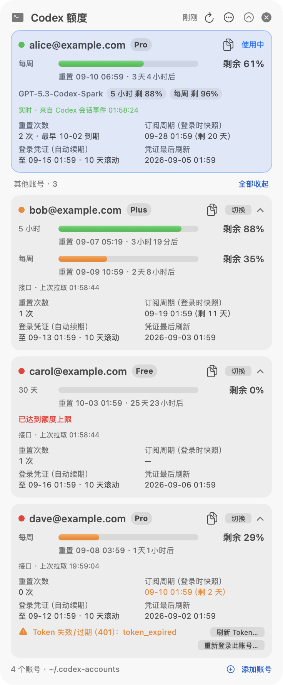
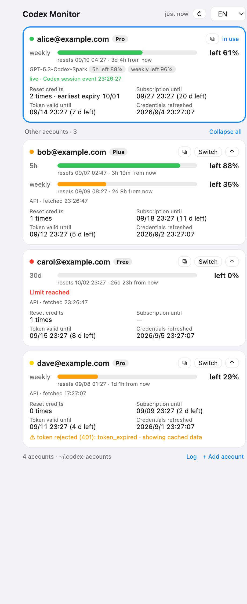

# Codex Monitor 📊

**Quota dashboard + multi-account manager for OpenAI Codex — see every account's remaining quota, reset time and reset credits in real time, and add or switch ChatGPT accounts without your tokens being rewritten behind your back.**

Runs everywhere Codex CLI runs: a native floating widget on **macOS**, and a local web dashboard + CLI (Python, standard library only) on **macOS, Linux and Windows**.

<p align="center">
  
  &nbsp;&nbsp;
  
  &nbsp;&nbsp;
  
</p>
<p align="center"><sub>Left: native macOS widget · Middle: web dashboard, identical on every OS · Right: the widget collapsed to a strip</sub></p>

[](#3--quick-start) · [](#3--quick-start) · [](Sources/CodexMonitor) · [](codex_monitor) · [](#6--how-it-works) · [](LICENSE) · [🇨🇳 中文说明](README_CN.md)

🈶 *The web dashboard is bilingual (English / 中文, follows your browser). The native macOS widget's text is Chinese; every string lives in [`Sources/CodexMonitor/Strings*.swift`](Sources/CodexMonitor), so an English localisation is a small PR.*

💡 *Codex Monitor reads the same `auth.json` that Codex CLI / the Codex desktop app use, calls the same read-only usage endpoints, and tails the same session logs — so the numbers match what Codex shows, in real time.*

## Contents

- [1. 🎯 Why](#1--why)
- [2. ✨ Features](#2--features)
- [3. 🚀 Quick Start](#3--quick-start)
- [4. 🧭 Using the widget](#4--using-the-widget)
- [5. 👥 Multiple accounts — `codex-monitor` CLI](#5--multiple-accounts--codex-monitor-cli)
- [6. ⚙️ How it works](#6--how-it-works)
- [7. 🔐 Security notes](#7--security-notes)
- [8. 🧪 Development & tests](#8--development--tests)
- [9. ❓ FAQ](#9--faq)
- [License](#license)

## 1. 🎯 Why

If you use Codex with a ChatGPT subscription you have probably run into these:

- **You want to see your quota without opening the Codex app.** Opening the app (or a CLI session) can refresh tokens and rewrite `~/.codex/auth.json`, which is annoying when you copy that file to other machines.
- **You have several ChatGPT accounts** and want to use them on *one* machine. `codex logout` revokes tokens, and logging in from a browser that already has a ChatGPT session silently picks the wrong account — so people end up dedicating one machine per account.
- **The usage page lags.** You want the number the Codex app shows, at the moment it changes.

Codex Monitor solves all three: a read-only widget that shows every account's quota, a one-click login flow that adds accounts into isolated directories, and a real-time feed taken from Codex's own session logs.

## 2. ✨ Features

**Widget (native macOS) and dashboard (any OS)**

- Per account: email, plan (Pro / Plus / Free / Team …), **remaining quota** for every rate-limit window (5-hour, weekly, 30-day …), **reset time + countdown**, **reset credits** ("Full reset" coupons and their expiry), per-model limits (e.g. GPT-5.3-Codex-Spark), **subscription expiry**, access-token validity, last credential refresh.
- **Real-time** — the panel tails Codex session rollouts and updates within a second of each model response; the usage API (30 s by default) is the fallback and calibration.
- **Collapsible** (widget): full panel → the active account as a card and the others as one-line rows (or all expanded) → a 46-px vertical strip pinned to the screen edge. Non-activating floating panel (clicking it never steals focus), draggable, remembers position, three window levels, starts at login via a LaunchAgent.
- **Dashboard** (any OS): the same cards in a local web page, bilingual, `--app` opens it as a chromeless window; starts at login via `codex-monitor autostart install`.
- One-click **switch** between accounts, **copy / export** any account's `auth.json`, **re-login** an account whose session was revoked.

**Multi-account**

- **Add accounts from the GUI**: an OAuth (authorization code + PKCE) login that opens the authorize page in a *private* browser window, so the account you are already logged into in your browser is never picked by mistake. No ChatGPT setting needs to be enabled.
- Device-code login as a fallback (for remote / headless use).
- Every account lives in its own `~/.codex-accounts/<name>/` directory, which doubles as an isolated `CODEX_HOME`. Switching copies one file; `codex-monitor run <name>` runs Codex with a different account in parallel without switching at all.
- Refreshed tokens are synced back: when Codex rewrites `~/.codex/auth.json`, the stored copy of that account is updated, so your archive never holds a stale refresh token.

**Web dashboard + CLI (`codex-monitor`)** — the same panel as a local web page for macOS / Linux / Windows, plus `add`, `relogin`, `import`, `save`, `list`, `status`, `use`, `run`, `env`, `export`, `sync`, `refresh`, `remove`, `serve`, `autostart`. Python 3.8+, standard library only; `codex-acct` is an alias.

## 3. 🚀 Quick Start

Both front-ends share the account store (`~/.codex-accounts`), but their interfaces and some features differ.

**For the native macOS floating widget in the screenshot, follow section 3.1 below.** The browser dashboard is a separate interface (3.2); `pip install` and `serve --app` do not install the native widget.

### 3.1 macOS — native floating widget

**Requirements:** macOS 14 or newer, access to GitHub, and a logged-in macOS desktop session. The same source commands compile for your local Apple Silicon or Intel architecture. Run the installer without `sudo`.

**1. Check the compiler.** Open Terminal and run:

```bash
xcrun swiftc --version
```

If the tools are missing, run the following command, finish installation in the dialog, and repeat the compiler check. Skip this step if tools are already installed.

```bash
xcode-select --install
```

**2. Download and install.** This example keeps the source in `~/Code/codex_monitor`. If that directory already exists, use the upgrade instructions instead.

```bash
mkdir -p ~/Code
cd ~/Code
git clone https://github.com/asimfish/codex_monitor.git
cd codex_monitor
bash scripts/install.sh
```

The script builds and starts `~/Applications/CodexMonitor.app`, configures launch at login, and links the CLI into `~/.local/bin`. Look for `CodexMonitor is running` and `done.`. Compilation time varies; wait for the shell prompt to return.

**3. Open and sign in.** If the panel is not visible:

```bash
open "$HOME/Applications/CodexMonitor.app"
```

An existing Codex login is detected automatically. Otherwise click “添加账号” (add account) and follow the browser login. The built-in browser login does not require the Codex CLI. Credentials belong to each user's machine and are not bundled with the source. The menu bar also lets you show the panel again.

**Upgrade an existing installation** (save your own source changes first):

```bash
cd ~/Code/codex_monitor
git switch main
git pull --ff-only
bash scripts/install.sh
```

Use your actual clone directory if it differs. Keep the clone: CLI symlinks point into it, while the native application lives in `~/Applications`. Run `bash scripts/uninstall.sh` to uninstall; stored accounts are retained.

#### Why can the appearance differ from screenshots?

The native panel uses macOS system materials and follows light/dark appearance; dark mode can look nearly black. Accessibility → Display → Reduce transparency replaces transparent areas with solid backgrounds ([Apple documentation](https://support.apple.com/en-ie/guide/mac-help/mchl11ddd4b3/mac)). Screenshots show one system configuration, not a guarantee of identical color or translucency everywhere.

**The reported black native window is still under investigation; its cause on the affected machine is not confirmed.** For missing text, a fully black window, or unexpected opacity after checking Reduce transparency, report a redacted screenshot, macOS version, installation method, and the output below. Do not upload `auth.json`. A successful build does not verify visual rendering.

```bash
sw_vers
uname -m
xcrun swiftc --version
git rev-parse HEAD
```

#### Reproduce a specific source version

This pins the CI-verified `6726148` commit in a new directory and builds/tests it without replacing the installed application:

```bash
git clone https://github.com/asimfish/codex_monitor.git codex_monitor_repro
cd codex_monitor_repro
git checkout --detach 6726148f2d288fc24467194aa323c4ae0fe35870
bash tests/run_store_tests.sh
bash tests/run_account_order_tests.sh
bash scripts/build.sh
```

Run `bash scripts/install.sh` afterward only to install that version; this replaces the existing native app. Compilation uses the system Swift toolchain without third-party Swift dependencies. Fabricated demo accounts can check layout, but do not validate real login or quota endpoints.

Scrolling, automatic/manual ordering, and duplicate-profile consolidation are native-widget features. Duplicate aliases for the same workspace and user appear once; files remain on disk. The active account stays pinned, with usable quota and unexpired credentials preferred among other accounts.

### 3.2 Any OS — web dashboard + CLI (Python 3.8+, no dependencies)

```bash
# install (pipx keeps it isolated; plain pip works too)
pipx install git+https://github.com/asimfish/codex_monitor.git
#   or:  pip install git+https://github.com/asimfish/codex_monitor.git
#   or, from a clone without installing anything:  python3 bin/codex-monitor ...   (Windows: py bin\codex-monitor ...)

codex-monitor serve            # starts http://127.0.0.1:7860/?token=… and opens it in your browser
codex-monitor serve --app      # …as a chromeless "app" window (Chrome/Edge), which looks like a widget
codex-monitor autostart install   # start it at login: LaunchAgent / systemd user unit or XDG autostart / Task Scheduler
```

The dashboard shows what `~/.codex/auth.json` is logged in as. **Add account** → name it → **Open in … private window** → sign in with the other ChatGPT account → the page redirects to `localhost:1455` and the new account appears. Everything else (switch, copy/export `auth.json`, re-login) is a button on the card.

The same things from the terminal:

```bash
codex-monitor add work                 # browser login into ~/.codex-accounts/work (opens a private window if a browser is found)
codex-monitor add work --device        # device-code login instead (see the note in section 5)
codex-monitor list                     # table: email / plan / token expiry / subscription / which one is active
codex-monitor status                   # remaining %, reset time, reset credits for every account
codex-monitor use work                 # make it the active login (writes ~/.codex/auth.json; old one synced/backed up)
codex-monitor run alt1                 # run codex as another account in this terminal without switching
codex-monitor export work ~/Desktop/   # copy an auth.json out for another machine
```

<details>
<summary><b>Windows notes</b></summary>

- Install Python 3 from python.org or the Microsoft Store and tick *Add to PATH*; then `pip install git+https://github.com/asimfish/codex_monitor.git` gives you `codex-monitor.exe` (or use `py -m codex_monitor …`).
- Codex CLI's home is `%USERPROFILE%\.codex`, accounts go to `%USERPROFILE%\.codex-accounts` — same layout as on macOS/Linux.
- Private windows: Chrome (`--incognito`), Edge (`--inprivate`), Brave, Firefox are detected under `Program Files` / `LocalAppData`.
- `codex-monitor run` shares `config.toml` by copying it (symlinks need Developer Mode on Windows); skill/plugin directories are not shared in that case.
- `autostart install` creates a Task Scheduler task (`CodexMonitorDashboard`, at logon, `pythonw.exe`, no console window). `autostart remove` deletes it.
- Keep the dashboard on top with PowerToys *Always On Top* (Win+Ctrl+T) if you want widget behaviour.
</details>

<details>
<summary><b>Linux notes</b></summary>

- `autostart install` writes a systemd user service (`~/.config/systemd/user/codex-monitor.service`, enabled and started) or, without systemd, an XDG autostart entry.
- Private windows: `google-chrome`, `chromium`, `brave`, `microsoft-edge`, `firefox` are looked up on `PATH`.
- Headless box? `codex-monitor add work --no-open` prints the login URL; open it on any machine with a browser — the redirect goes to `localhost:1455` **on the machine running codex-monitor**, so forward the port (`ssh -L 1455:localhost:1455 box`) or use `--device`.
</details>

### 3.3 Verification scope and downloads

[Successful CI for pinned version 6726148](https://github.com/asimfish/codex_monitor/actions/runs/35210407282) verifies:

| Check | Verified environment | Limits |
|---|---|---|
| Python tests, `pip install .`, CLI help | GitHub Windows, Linux and macOS runners, Python 3.11 | Does not verify real login, autostart or every desktop interaction on all three platforms |
| Swift storage/order tests, native build and packaging | `macos-14` runner, Apple Silicon | Does not verify Intel hardware or appearance on every macOS version |
| Native installation, launch at login, real account use | Developer Mac: macOS 26.2, Apple Silicon | Does not guarantee identical transparency on another Mac |

For the compiled app, open the CI link above → **Artifacts** → `CodexMonitor-macos` (GitHub sign-in is usually required; artifacts expire). The download contains an application ZIP; extract it to obtain `CodexMonitor.app`. This is an Apple Silicon build, ad-hoc signed and not Apple-notarized. Section 3.1's source installer is recommended and also configures autostart. Intel users should build from source.

## 4. 🧭 Using the widget

| Where | What |
|---|---|
| Menu bar | remaining % of the active account; menu: switch account, show/hide/collapse panel, refresh, window level, launch at login, add account |
| Panel header | last refresh · refresh now · ⋯ settings (refresh interval 15 s – 5 min, window level, launch at login, log) · ˄ collapse to strip · × hide |
| Active card | quota bars per window, reset time + countdown, per-model limits, data-source line (`live · from Codex session event hh:mm:ss` or `API · fetched hh:mm:ss`), reset credits, subscription expiry, token validity, last refresh |
| Other accounts | one-line rows (click a row to expand, ˄ to collapse) or **Expand all / Collapse all**; each has **Switch** and a ⧉ menu: copy `auth.json` contents, copy path, reveal in Finder, export…, re-login… |
| Strip | status dot, vertical quota bar, remaining %, short countdown; only the bottom arrow expands (the rest just drags) |

Colours: green > 50 % remaining, orange 20–50 %, red ≤ 20 % or limit reached; yellow dot = showing cached data; grey = not loaded yet.

Click “调整顺序” (reorder) beside the other-accounts heading, then use the arrows to move an account up, down, to the top or to the bottom. Click “完成” (done) when finished. Automatic ordering defaults to accounts with remaining quota and unexpired credentials first; exhausted or errored accounts follow. The active account stays pinned above the list. Moving an account saves a custom order across restarts; click “自动排序” (automatic order) to restore the default.

## 5. 👥 Multiple accounts — `codex-monitor` CLI

Everything the GUI does is also available from the terminal (`codex-acct` is an alias of `codex-monitor`):

```bash
codex-monitor save main             # archive the current ~/.codex login as an account (just a copy)
codex-monitor add work              # browser login into ~/.codex-accounts/work (private window; no ChatGPT setting needed)
codex-monitor add work --device     # device-code login instead (see note below)
codex-monitor relogin work          # sign the same account in again when its session was revoked
codex-monitor import old ~/Downloads/auth.json   # bring in an auth.json you already have
codex-monitor list                  # table: email / plan / token expiry / subscription / which one is active
codex-monitor status                # fetch quota for every account: remaining %, reset time, reset credits
codex-monitor use work              # switch: write this account into ~/.codex/auth.json (old one synced/backed up first)
codex-monitor run alt1              # don't switch — run codex with alt1 in this terminal (parallel use)
eval "$(codex-monitor env alt1)"    # same, for every codex call in this shell (PowerShell syntax is printed on Windows)
codex-monitor export work ~/tmp/    # copy an auth.json out for another machine
codex-monitor sync                  # pull a refreshed ~/.codex/auth.json back into its account directory
codex-monitor refresh work          # (optional, confirmed) explicit token refresh
```

Layout:

```
~/.codex/auth.json                    what Codex CLI / the desktop app actually read
~/.codex-accounts/
  main/auth.json                      one directory per account = one isolated CODEX_HOME
  work/auth.json
  _backup/auth-<email>-<time>.json    backups of an un-archived main auth.json taken before `use`
  .cache/usage-<account_id>.json      the widget's last usage snapshot per account
```

`codex-monitor run` symlinks `config.toml`, `AGENTS.md`, `skills/`, `plugins/`, `agents/` into the account directory, so configuration is shared and only credentials and session history are separate (on Windows `config.toml` is copied instead).

> **Device-code login needs a ChatGPT setting.** `codex login --device-auth` only works after the target account enables *Device code authorization for Codex* under ChatGPT → Settings → Security. Browser login (the default everywhere — widget, dashboard and CLI) does not need it.

## 6. ⚙️ How it works

**Data sources**

| Source | Used for | Frequency |
|---|---|---|
| `auth.json` (JWT claims) | email, plan, account id, **subscription period as checked at login** (`chatgpt_subscription_last_checked`), access-token lifetime | on change (polled every 10 s) |
| `GET {chatgpt_base_url}/wham/usage` | rate-limit windows, per-model limits, credits, reset-credit count | every 30 s (configurable 15 s – 5 min) |
| `GET …/wham/rate-limit-reset-credits` | reset coupons and their expiry | every 3 min |
| `~/.codex/sessions/**/rollout-*.jsonl` (`token_count` events) | **real-time** rate limits after every model response of CLI / `codex exec` sessions — identical to what the Codex app shows | tailed every 1 s (only bytes appended to files modified in the last 15 min; every day directory is walked every 10 s because long-lived threads sit under their creation date) |
| `$CODEX_HOME/logs_*.sqlite` rows `account/rateLimits/updated` | **trigger** for desktop-app usage: those threads no longer write rollouts, but the app-server logs one row per rate-limit update, so the usage API is fetched immediately | checked every 1 s (indexed query, ~20 ms) |

**Latency budget** (measured on the author's machine while the desktop app was in use): responses recorded in a rollout file showed up in the panel **0.0–0.8 s** later; threads that no longer write rollouts are covered by the log trigger at ≈ 1.5–2.5 s (≤1 s to notice the row + ~1.2 s usage-API round trip); usage from other devices or Codex Cloud only via the periodic poll (30 s default → 15 s average; pick 15 s for 7.5 s).

Live events win when they are newer than the last API fetch, or when the API still reports *less* usage for the same window than an event from the last 2 minutes (the usage endpoint can lag the per-response headers slightly). `~/.codex/sessions` is attributed to the active account (events before the last `auth.json` change are ignored); `~/.codex-accounts/<name>/sessions` to that account.

**Read-only guarantees**

Codex Monitor does not refresh tokens on a schedule and never rewrites a *working* `auth.json`. Writes happen only in these cases:

- user actions: *Switch*, *Save as account*, *Refresh token…*, *Re-login…*;
- the one-way "adopt" copy that mirrors a `~/.codex/auth.json` Codex itself just refreshed into the matching account directory (no network involved);
- **automatic refresh after a 401**: when the server rejects an access token (or it has expired), the refresh token is exchanged **once per account per 10 minutes** and the fetch is retried — exactly what Codex does on a 401. A rejected token is already dead everywhere, so this cannot break a copy on another machine; without it a revoked session would keep showing stale numbers forever (the plan badge stuck on an old value, for example). Disable with the widget's *401 时自动刷新* toggle, `codex-monitor serve --no-auto-refresh`, or `CODEX_MONITOR_NO_AUTO_REFRESH=1`. If the refresh itself fails the card says the session was revoked and offers *Re-login*.

**Two implementations, one behaviour.** The Swift widget and the Python package implement the same store layout, the same API calls, the same rollout tailing and the same OAuth flow; both are covered by the tests in `tests/`. Proxies: the Python side honours `HTTPS_PROXY`/`HTTP_PROXY`, the macOS system proxy (`scutil --proxy`) and the Windows registry proxy; the widget uses the system proxy through URLSession.

**Login flow**

Browser mode reproduces Codex CLI's own OAuth client: same `client_id`, `redirect_uri=http://localhost:1455/auth/callback`, `S256` PKCE, form-encoded `POST https://auth.openai.com/oauth/token`. The app runs the loopback listener itself and writes an `auth.json` in exactly the shape Codex writes. Device-code mode spawns `codex login --device-auth` with `CODEX_HOME` pointing at the account directory and parses the URL and code from its output.

## 7. 🔐 Security notes

- `auth.json` files contain bearer tokens. Codex Monitor stores them with mode `0600` and never sends them anywhere except `chatgpt.com` / `auth.openai.com`. "Copy auth.json" puts the whole file (including tokens) on your clipboard — that is the point, but be aware.
- One `auth.json` on two machines: whichever refreshes first may invalidate the other's refresh token. Prefer `codex-monitor export` per machine, and avoid refreshing the same account from both sides.
- `codex logout` revokes tokens server-side (`/oauth/revoke`). With per-account directories you never need it.
- Nothing in this repository contains credentials; `~/.codex-accounts` is outside the repo.

## 8. 🧪 Development & tests

```
codex_monitor/          Python package (stdlib only, 3.8+): store, usage API + rollout tailer, OAuth, web dashboard, autostart
  web.py / web_i18n.py  the dashboard (single HTML page, EN + 中文)
bin/codex-monitor       run the CLI straight from a checkout (bin/codex-acct is the same thing)
Sources/CodexMonitor/   Swift (SwiftUI + AppKit) native widget; Strings*.swift hold all its text
scripts/build.sh        swiftc build + ad-hoc codesign;  scripts/install.sh / uninstall.sh
tests/test_python.py    22 unit/integration tests: parsing, tailer, views, OAuth (fake callback), auto-refresh on 401, app-server log trigger, web API, simulated Windows branches
tests/test_cli.py       sandboxed end-to-end test of the CLI (temp CODEX_HOME, fake JWTs, no network)
tests/linux_smoke.sh    what the Docker check runs: tests + pip install + dashboard boot + autostart on Linux
tests/run_store_tests.sh  Swift tests (macOS)
```

```bash
python3 tests/test_python.py && python3 tests/test_cli.py            # any OS
bash tests/run_account_order_tests.sh                                  # account ordering
./tests/run_store_tests.sh                                             # macOS, Swift side
tar --exclude=.git -c . | docker run --rm -i python:3.8-slim bash -c 'mkdir /src && tar -x -C /src && bash /src/tests/linux_smoke.sh'
CODEX_MONITOR_DEMO=1 codex-monitor serve                               # dashboard with fabricated accounts, no network
CODEX_MONITOR_DEMO=1 CODEX_MONITOR_SNAPSHOT=/tmp/panel.png ~/Applications/CodexMonitor.app/Contents/MacOS/CodexMonitor   # widget → PNG
CODEX_MONITOR_TEST_LOGIN=browser ~/Applications/CodexMonitor.app/Contents/MacOS/CodexMonitor   # widget OAuth self-test
```

The Swift build happens in `~/Library/Caches/CodexMonitor/build` because iCloud-synced folders attach extended attributes asynchronously and `codesign` then rejects the bundle.

## 9. ❓ FAQ

**A card shows an old plan / old numbers.** The account's token was probably rejected (401) and, if automatic refresh is off or the refresh token was revoked too, no fresh data can arrive; the yellow dot and the "cached data" note say so. Turn automatic refresh on, or use *Re-login…* on that account.

**The subscription date does not match what I just bought.** That field is a *snapshot taken when the account logged in* (`chatgpt_subscription_last_checked` in the id_token). Token refreshes do not re-check it and no endpoint reachable with a Codex token returns the live billing period, so the card labels it "snapshot at login" and shows the check time. The *plan* badge is live from the usage API. Re-login the account to refresh the snapshot.

**"Credential (auto-renews) until …" — is my account expiring?** No. Access tokens live 10 days and Codex (and the monitor, after a 401) renews them automatically; the line only tells you how old the current credential is. It turns red only if a token is actually expired and could not be renewed.

**The device-code page says to enable device code authorization.** Enable it under ChatGPT → Settings → Security for that account, or simply use the default browser login.

**Numbers differ from the usage page for a minute.** The usage API can lag; the live line under the bars tells you which source you are looking at. The Codex app and the widget use the same session events.

**Port 1455 is busy.** Another `codex login` (or the Codex app's login) is running; finish or cancel it and retry.

**The dashboard says 403.** Open it through the exact URL `codex-monitor serve` printed — it carries a per-run token that stops other websites in your browser from driving the API.

**Started at login but the dashboard took ages to appear.** Fixed in 1.0: the LaunchAgent used to run at `Background` priority, which gets starved on busy Macs. Re-run `codex-monitor autostart install`.

## License

[MIT](LICENSE)
