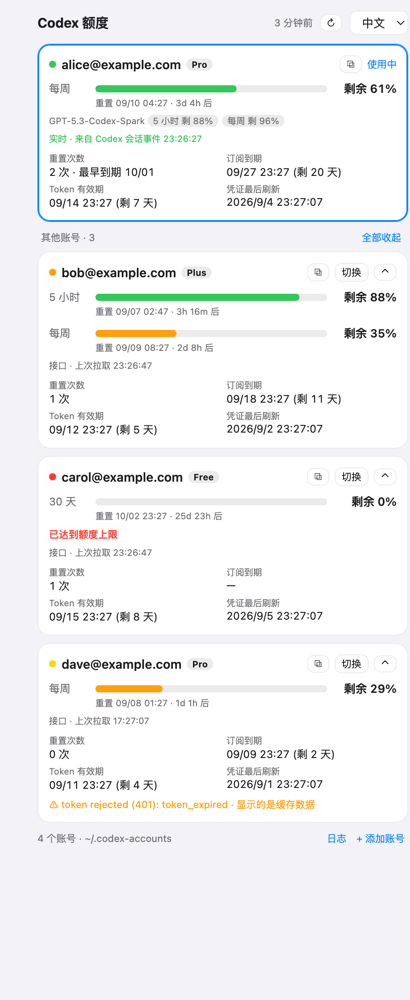

# Codex Monitor 📊

**Codex 额度看板 + 多账号管理器：实时看到每个账号的剩余额度、重置时间、重置次数，在一台机器上添加/切换多个 ChatGPT 账号——除非你主动操作，它永远不会碰你的 token。**

Codex CLI 能跑的地方它都能跑：**macOS** 上是原生桌面悬窗；**macOS / Linux / Windows** 上都有本地网页仪表盘 + 命令行（Python，仅标准库）。

<p align="center">
  
  &nbsp;&nbsp;
  
  &nbsp;&nbsp;
  
</p>
<p align="center"><sub>左：macOS 原生悬窗 · 中：网页仪表盘，三个系统一样 · 右：悬窗折叠成竖条</sub></p>

[](#3--快速开始) · [](#3--快速开始) · [](Sources/CodexMonitor) · [](codex_monitor) · [](#6--工作原理) · [](LICENSE) · [🇬🇧 English](README.md)

💡 *Codex Monitor 读的是 Codex CLI / 桌面端同一份 `auth.json`，调的是同样的只读用量接口，tail 的是同一份会话日志——所以数字和 Codex 里显示的一致，而且是实时的。*

## 目录

- [1. 🎯 为什么做这个](#1--为什么做这个)
- [2. ✨ 功能](#2--功能)
- [3. 🚀 快速开始](#3--快速开始)
- [4. 🧭 悬窗怎么用](#4--悬窗怎么用)
- [5. 👥 多账号：`codex-monitor` 命令行](#5--多账号codex-monitor-命令行)
- [6. ⚙️ 工作原理](#6--工作原理)
- [7. 🔐 安全说明](#7--安全说明)
- [8. 🧪 开发与测试](#8--开发与测试)
- [9. ❓ 常见问题](#9--常见问题)
- [许可证](#许可证)

## 1. 🎯 为什么做这个

用 ChatGPT 订阅跑 Codex 的人大概都遇到过：

- **想看额度，但不想开 Codex App。** 开 App（或起一个 CLI 会话）可能刷新 token、改写 `~/.codex/auth.json`——如果你把这个文件拷到别的机器用，会很烦。
- **有好几个 ChatGPT 账号**，想在一台机器上用。`codex logout` 会吊销 token；在已经登录了某个账号的浏览器里再登录，又会被静默选成那个账号——于是只能一台机器登一个号。
- **用量页面有延迟。** 想要的是 Codex App 里那个数字，而且是它变化的那一刻。

Codex Monitor 把这三件事一起解决：一个只读的悬窗显示所有账号的额度；一键把新账号登录进各自独立的目录；从 Codex 自己的会话日志里拿到实时数据。

## 2. ✨ 功能

**悬窗（macOS 原生）与仪表盘（任意系统）**

- 每个账号：邮箱、套餐（Pro / Plus / Free / Team …）、每个限速窗口（5 小时 / 每周 / 30 天 …）的**剩余额度**、**重置时间 + 倒计时**、**重置次数**（「Full reset」重置券数量与最早到期日）、附加模型额度（如 GPT-5.3-Codex-Spark）、**订阅到期时间**、access token 有效期、凭证最后刷新时间。
- **实时**：面板 tail Codex 的会话 rollout，每轮模型响应后 1 秒内更新；用量接口（默认 30 秒）作为兜底和校准。
- **可折叠**（悬窗）：完整面板 → 当前账号是完整卡片、其他账号一行摘要（或全部展开）→ 贴屏幕边的 46px 竖条。非激活浮动面板（点它不抢焦点）、可拖动、记住位置、三种层级、LaunchAgent 开机自启。
- **仪表盘**（任意系统）：同样的卡片做成本地网页，中英双语，`--app` 可以开成无边框的独立窗口；`codex-monitor autostart install` 开机自启。
- 一键**切换**账号、**复制 / 导出**任意账号的 `auth.json`、**重新登录**被服务端作废会话的账号。

**多账号**

- **在 GUI 里添加账号**：App 自己实现的 OAuth（授权码 + PKCE）登录，把授权页开在浏览器*隐身窗口*里，不会误选浏览器里已登录的账号。**不需要在 ChatGPT 里开任何设置。**
- 设备码登录作为备选（远程 / 无浏览器时）。
- 每个账号一个 `~/.codex-accounts/<名字>/` 目录，同时就是一个隔离的 `CODEX_HOME`。切换只是拷一个文件；`codex-monitor run <名字>` 可以不切换、直接用另一个账号并行跑 Codex。
- 刷新过的 token 会回流：Codex 改写 `~/.codex/auth.json` 后，对应账号的存档会同步更新，存档里永远是最新的 refresh_token。

**网页仪表盘 + 命令行 `codex-monitor`**：`serve`、`autostart`、`add`、`relogin`、`import`、`save`、`list`、`status`、`use`、`run`、`env`、`export`、`sync`、`refresh`、`remove`。Python 3.8+，仅标准库；`codex-acct` 是同一个命令的别名。

## 3. 🚀 快速开始

两个前端共用同一套账号目录（`~/.codex-accounts`）和同一套逻辑，用其中一个或两个都可以。

### 3.1 任意系统：网页仪表盘 + 命令行（Python 3.8+，零依赖）

```bash
# 安装（pipx 隔离安装；直接 pip 也行）
pipx install git+https://github.com/asimfish/codex_monitor.git
#   或：pip install git+https://github.com/asimfish/codex_monitor.git
#   或：克隆后不安装直接跑：python3 bin/codex-monitor ...   （Windows：py bin\codex-monitor ...）

codex-monitor serve               # 启动 http://127.0.0.1:7860/?token=… 并在浏览器打开
codex-monitor serve --app         # 开成无边框的独立窗口（Chrome/Edge），像个小组件
codex-monitor autostart install   # 开机自启：LaunchAgent / systemd 用户服务或 XDG autostart / 任务计划程序
```

仪表盘显示 `~/.codex/auth.json` 当前登录的账号。**添加账号** → 起名 → **用 … 隐身窗口打开** → 用另一个 ChatGPT 账号登录 → 页面跳回 `localhost:1455`，新账号出现。切换、复制/导出 `auth.json`、重新登录都是卡片上的按钮。

同样的事在终端里：

```bash
codex-monitor add work                 # 浏览器登录到 ~/.codex-accounts/work（找到浏览器就自动开隐身窗口）
codex-monitor add work --device        # 改用设备码登录（见第 5 节说明）
codex-monitor list                     # 表格：邮箱 / 套餐 / token 到期 / 订阅到期 / 谁在使用中
codex-monitor status                   # 每个账号的剩余 %、重置时间、重置次数
codex-monitor use work                 # 设为当前账号（写入 ~/.codex/auth.json；原凭证先同步/备份）
codex-monitor run alt1                 # 不切换，直接在这个终端用另一个账号跑 codex
codex-monitor export work ~/Desktop/   # 拷一份 auth.json 给别的机器
```

<details>
<summary><b>Windows 说明</b></summary>

- 从 python.org 或 Microsoft Store 装 Python 3，勾选 *Add to PATH*；`pip install git+https://github.com/asimfish/codex_monitor.git` 之后就有 `codex-monitor.exe`（或用 `py -m codex_monitor …`）。
- Codex CLI 的目录是 `%USERPROFILE%\.codex`，账号存在 `%USERPROFILE%\.codex-accounts`，和 macOS/Linux 布局一致。
- 隐身窗口：会在 `Program Files` / `LocalAppData` 下找 Chrome（`--incognito`）、Edge（`--inprivate`）、Brave、Firefox。
- `codex-monitor run` 在 Windows 上用复制的方式共享 `config.toml`（符号链接需要开发者模式），skills/plugins 目录不共享。
- `autostart install` 会创建任务计划程序任务 `CodexMonitorDashboard`（登录时运行，`pythonw.exe`，无控制台窗口）；`autostart remove` 删除它。
- 想让仪表盘置顶，可以用 PowerToys 的 *Always On Top*（Win+Ctrl+T）。
</details>

<details>
<summary><b>Linux 说明</b></summary>

- `autostart install` 写 systemd 用户服务（`~/.config/systemd/user/codex-monitor.service`，已启用并启动）；没有 systemd 时写 XDG autostart 项。
- 隐身窗口：在 `PATH` 上找 `google-chrome`、`chromium`、`brave`、`microsoft-edge`、`firefox`。
- 无图形的服务器？`codex-monitor add work --no-open` 只打印登录链接，在任何有浏览器的机器上打开——但回调会打到**运行 codex-monitor 的那台机器**的 `localhost:1455`，需要转发端口（`ssh -L 1455:localhost:1455 box`）或改用 `--device`。
</details>

### 3.2 macOS：原生悬窗（菜单栏 + 浮动面板）

需要 macOS 14+ 和 Xcode Command Line Tools（`xcode-select --install`，提供 `swiftc`）。

```bash
git clone https://github.com/asimfish/codex_monitor.git
cd codex_monitor
./scripts/install.sh
```

`install.sh` 编译 `CodexMonitor.app`（ad-hoc 签名，约 1 分钟），装到 `~/Applications`，注册开机自启的 LaunchAgent，并把命令行软链到 `~/.local/bin/codex-monitor` / `codex-acct`。再跑一次即升级；`./scripts/uninstall.sh` 卸载（不会删你存的账号）。悬窗出现在屏幕右上角；添加账号的操作和仪表盘完全一样（**添加账号** → 隐身窗口 → 完成）。

### 3.3 在哪些环境验证过

| | macOS 26（Apple 芯片） | Linux（Debian，Docker `python:3.8-slim` / `3.12-slim`） | Windows |
|---|---|---|---|
| Python 测试（`tests/test_python.py`、`tests/test_cli.py`） | ✅ Python 3.9 | ✅ 3.8 与 3.12 | 未真机运行——Windows 专属分支在测试里用模拟的 `os.name == "nt"` 覆盖 |
| `pip install .`、`codex-monitor --version`、仪表盘启动、`autostart install/remove` | ✅ | ✅（XDG autostart 路径；容器里没有 systemd） | 未真机运行 |
| 真实账号：用量接口、实时 rollout 事件、OAuth 浏览器登录 | ✅（5 个账号） | – | – |
| 原生悬窗 | ✅ | – | – |

如果你在 Windows 上跑了，不管好坏都欢迎开 issue 反馈。

## 4. 🧭 悬窗怎么用

| 位置 | 内容 |
|---|---|
| 菜单栏 | 当前账号剩余 %；菜单：切换账号、显示/隐藏/折叠面板、立即刷新、窗口层级、开机自启、添加账号 |
| 面板标题栏 | 上次刷新 · 立即刷新 · ⋯ 设置（刷新间隔 15 秒～5 分钟、窗口层级、开机自启、日志）· ˄ 折叠为竖条 · × 隐藏 |
| 当前账号卡片 | 每个窗口的额度条、重置时间 + 倒计时、附加模型额度、数据来源行（`实时 · 来自 Codex 会话事件 hh:mm:ss` 或 `接口 · 上次拉取 hh:mm:ss`）、重置次数、订阅到期、Token 有效期、凭证最后刷新 |
| 其他账号 | 一行摘要（点击展开，˄ 收起）或「全部展开 / 全部收起」；每个都有「切换」和 ⧉ 菜单：复制 auth.json 内容、复制路径、在 Finder 中显示、导出…、重新登录… |
| 竖条 | 状态点、竖向额度条、剩余 %、短倒计时；只有底部箭头会展开，其他区域只用来拖动 |

颜色：剩余 > 50% 绿，20–50% 橙，≤ 20% 或已达上限红；黄点 = 显示的是缓存；灰 = 尚未加载。

## 5. 👥 多账号：`codex-monitor` 命令行

GUI 能做的事在终端里也都能做（`codex-acct` 是 `codex-monitor` 的别名）：

```bash
codex-monitor save main             # 先把现在 ~/.codex 的登录存成一个账号（只是复制一份）
codex-monitor add work              # 浏览器登录到 ~/.codex-accounts/work（隐身窗口；不需要任何 ChatGPT 设置）
codex-monitor add work --device     # 改用设备码登录（见下方说明）
codex-monitor relogin work          # 会话被作废时，用同一个账号重新登录覆盖
codex-monitor import old ~/Downloads/auth.json   # 收进一份已有的 auth.json
codex-monitor list                  # 表格：邮箱 / 套餐 / token 到期 / 订阅到期 / 谁在使用中
codex-monitor status                # 拉一遍所有账号的额度：剩余 %、重置时间、重置次数
codex-monitor use work              # 切换：写入 ~/.codex/auth.json（原凭证先同步/备份）
codex-monitor run alt1              # 不切换，直接用 alt1 跑 codex（可与主账号并行）
eval "$(codex-monitor env alt1)"    # 当前 shell 后续的 codex 都用 alt1（Windows 打印 PowerShell 语法）
codex-monitor export work ~/tmp/    # 拷一份给别的机器
codex-monitor sync                  # 把 ~/.codex 里刷新过的 token 同步回所属账号目录
codex-monitor refresh work          # （可选，需确认）显式刷新 token
```

目录结构：

```
~/.codex/auth.json                    Codex CLI / 桌面端真正读的那份
~/.codex-accounts/
  main/auth.json                      每个子目录 = 一个账号 = 一个独立 CODEX_HOME
  work/auth.json
  _backup/auth-<email>-<time>.json    use 之前对未归档主凭证的备份
  .cache/usage-<account_id>.json      悬窗缓存的最近一次额度快照
```

`codex-monitor run` 会把 `config.toml`、`AGENTS.md`、`skills/`、`plugins/`、`agents/` 软链进账号目录，配置和技能共享，只有凭证和会话历史分开（Windows 上 `config.toml` 改为复制）。

> **设备码登录需要先在 ChatGPT 里开一个设置。** `codex login --device-auth` 只有在目标账号于 ChatGPT → 设置 → 安全 里打开「Codex 设备代码授权」后才能用，否则页面会提示「请在 ChatGPT 安全设置中为 Codex 启用设备代码授权」。浏览器登录（悬窗、仪表盘、命令行的默认方式）不需要这一步。

## 6. ⚙️ 工作原理

**数据来源**

| 来源 | 用途 | 频率 |
|---|---|---|
| `auth.json`（JWT claims） | 邮箱、套餐、账号 id、订阅到期、token 有效期 | 变化即读（每 10 秒轮询 mtime） |
| `GET {chatgpt_base_url}/wham/usage` | 限速窗口、附加模型额度、额度包、重置券数量 | 每 30 秒（可选 15 秒～5 分钟） |
| `GET …/wham/rate-limit-reset-credits` | 重置券及其到期日 | 每 3 分钟 |
| `~/.codex/sessions/YYYY/MM/DD/rollout-*.jsonl` 里的 `token_count` 事件 | **实时**：每轮模型响应后的限速信息，与 Codex App 显示的完全一致 | 每 2 秒 tail 一次（只读最近 15 分钟内有写入的文件的新增字节） |

实时事件比上次接口拉取更新时优先显示；如果接口对同一窗口报的已用比例比 2 分钟内的本地事件还低（接口有时略滞后于逐响应的头信息），也以本地事件为准。`~/.codex/sessions` 归给当前使用中的账号（只认切换 `auth.json` 之后的事件）；`~/.codex-accounts/<名字>/sessions` 归给对应账号。

**只读保证**

悬窗从不调用 OAuth refresh 接口，也从不主动改写任何 `auth.json`。仅有的写操作都由你触发：「切换」「存为账号」「刷新 Token…」（弹窗确认；按钮只在 token 过期/失效时出现）「重新登录…」，以及单向的「回流」复制——把 Codex 自己刚刷新过的 `~/.codex/auth.json` 复制进对应账号目录（不涉及网络）。

**两套实现，一种行为。** Swift 悬窗和 Python 包实现的是同一套目录布局、同样的接口调用、同样的 rollout tail 和同样的 OAuth 流程，`tests/` 里都有覆盖。代理：Python 端支持 `HTTPS_PROXY`/`HTTP_PROXY`、macOS 系统代理（`scutil --proxy`）和 Windows 注册表代理；悬窗通过 URLSession 使用系统代理。

**登录流程**

浏览器模式复刻了 Codex CLI 自己的 OAuth 客户端：同一个 `client_id`、`redirect_uri=http://localhost:1455/auth/callback`、S256 PKCE、表单编码的 `POST https://auth.openai.com/oauth/token`。App 自己起回调监听，并写出与 Codex 完全一致格式的 `auth.json`。设备码模式则在 `CODEX_HOME` 指向账号目录的情况下运行 `codex login --device-auth`，从输出里解析链接和代码。

## 7. 🔐 安全说明

- `auth.json` 里是 bearer token。Codex Monitor 以 `0600` 权限保存，除 `chatgpt.com` / `auth.openai.com` 外不会把它发到任何地方。「复制 auth.json 内容」会把整个文件（含 token）放进剪贴板——这正是它的用途，但请留意。
- 同一份 `auth.json` 放在两台机器上：谁先刷新，另一台手里的 refresh_token 之后就可能失效。建议每台机器 `codex-monitor export` 一份，并避免两边都刷新同一账号。
- `codex logout` 会在服务端吊销 token（`/oauth/revoke`）。用了按账号分目录的方式后，永远不需要 logout。
- 本仓库不包含任何凭证；`~/.codex-accounts` 在仓库之外。

## 8. 🧪 开发与测试

```
codex_monitor/          Python 包（仅标准库，3.8+）：账号存储、用量接口 + rollout tail、OAuth、网页仪表盘、开机自启
  web.py / web_i18n.py  仪表盘（单页 HTML，中英双语）
bin/codex-monitor       克隆后直接运行命令行（bin/codex-acct 是同一个东西）
Sources/CodexMonitor/   Swift（SwiftUI + AppKit）原生悬窗；Strings*.swift 是全部文案
scripts/build.sh        swiftc 编译 + ad-hoc 签名；scripts/install.sh / uninstall.sh
tests/test_python.py    17 个单元/集成测试：解析、tail、视图、OAuth（伪造回调）、Web API、模拟的 Windows 分支
tests/test_cli.py       命令行沙盒端到端测试（临时 CODEX_HOME、伪造 JWT、不联网）
tests/linux_smoke.sh    Docker 检查跑的脚本：测试 + pip 安装 + 仪表盘启动 + Linux 自启
tests/run_store_tests.sh  Swift 测试（macOS）
```

```bash
python3 tests/test_python.py && python3 tests/test_cli.py            # 任意系统
./tests/run_store_tests.sh                                             # macOS，Swift 端
tar --exclude=.git -c . | docker run --rm -i python:3.8-slim bash -c 'mkdir /src && tar -x -C /src && bash /src/tests/linux_smoke.sh'
CODEX_MONITOR_DEMO=1 codex-monitor serve                               # 演示模式：伪造账号，不联网
CODEX_MONITOR_DEMO=1 CODEX_MONITOR_SNAPSHOT=/tmp/panel.png ~/Applications/CodexMonitor.app/Contents/MacOS/CodexMonitor   # 悬窗渲染成 PNG
CODEX_MONITOR_TEST_LOGIN=browser ~/Applications/CodexMonitor.app/Contents/MacOS/CodexMonitor   # 悬窗 OAuth 链路自检
```

Swift 构建放在 `~/Library/Caches/CodexMonitor/build`：iCloud 同步的目录会异步挂上扩展属性，`codesign` 会因此拒签。

## 9. ❓ 常见问题

**卡片显示「Token 失效/过期（401）」，但 token 的 `exp` 还没到。** 会话被服务端作废了（改密码、「退出所有设备」、套餐变动……）。对该账号用「重新登录…」。

**设备码页面提示要开启设备代码授权。** 到该账号的 ChatGPT → 设置 → 安全 里打开，或者直接用默认的浏览器登录。

**数字和用量页面差了一会儿。** 用量接口有时会滞后；额度条下方那行小字会告诉你当前看的是哪个来源。Codex App 和悬窗用的是同一份会话事件。

**1455 端口被占用。** 有另一个 `codex login`（或 Codex App 的登录）在进行，结束或取消后重试。

**仪表盘打开是 403。** 请用 `codex-monitor serve` 打印出来的那个完整 URL 打开——它带一个每次运行随机生成的 token，防止浏览器里的其他网站调用这个接口。

**开机自启后仪表盘很久才出现。** 1.0 已修：之前 LaunchAgent 用的是 `Background` 优先级，在繁忙的 Mac 上会被饿死。重新执行 `codex-monitor autostart install` 即可。

## 许可证

[MIT](LICENSE)
